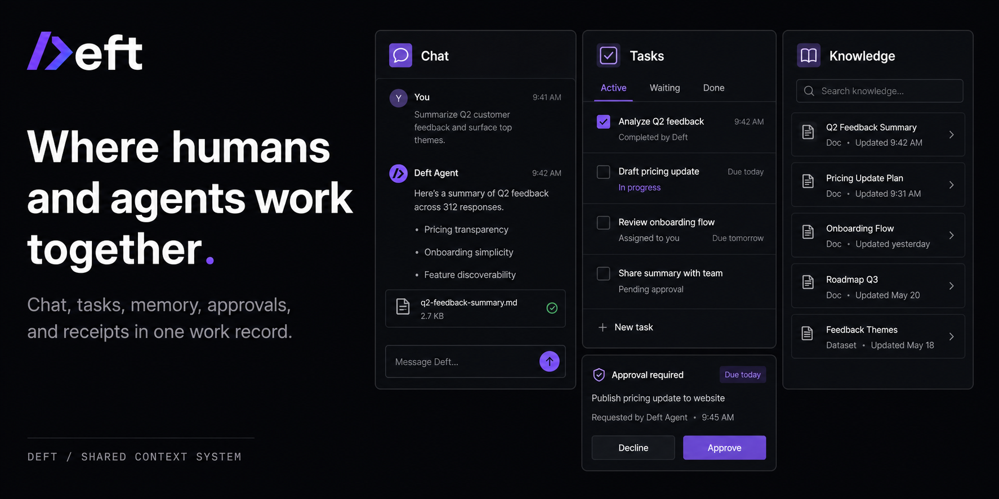
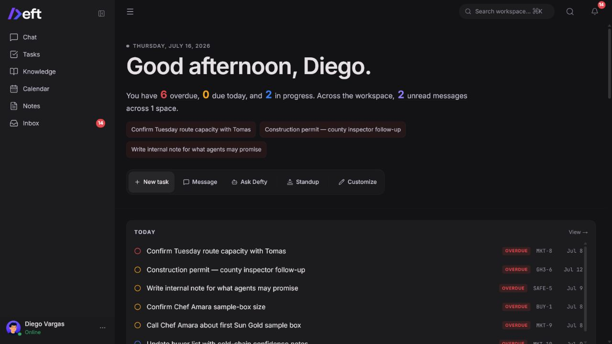
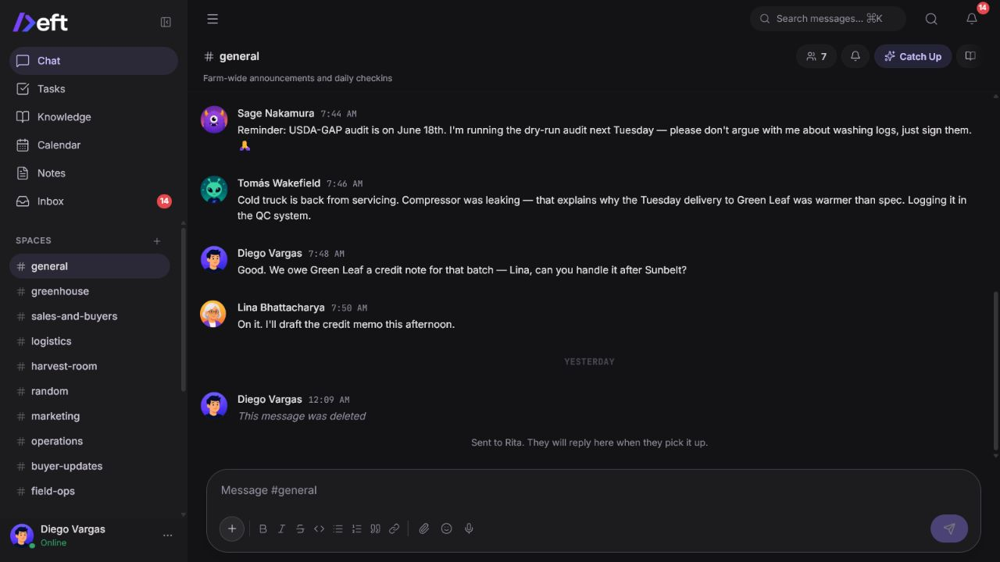
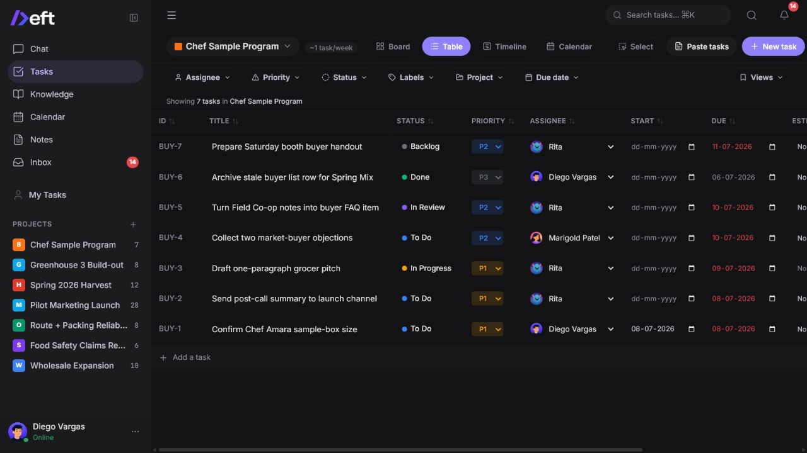
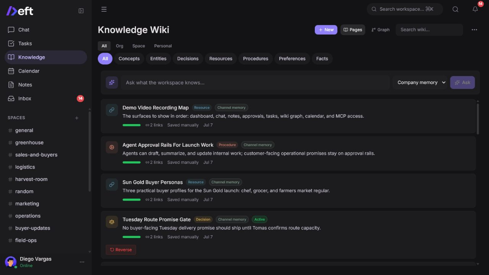
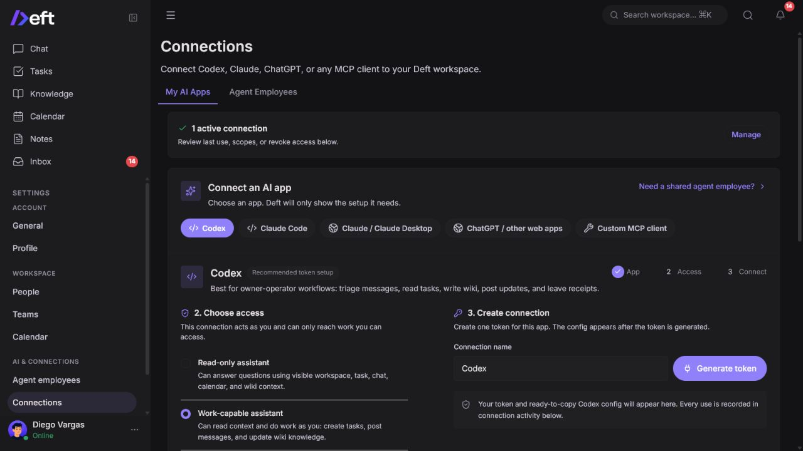

# Deft

### Where humans and agents work together.

[](https://github.com/Maneek21/Deft/actions/workflows/ci.yml)
[](./LICENSE)
[](#project-status-and-limitations)

[Website](https://deft.ing) | [Live demo](https://demo.deft.ing) | [Self-hosting guide](docs/self-hosting.md) | [Contributing](CONTRIBUTING.md)



Deft is a self-hostable, open-source workspace where people and AI agents share the same chat, tasks, knowledge, calendar context, approvals, and receipts.

Instead of pasting fragments from Slack, Notion, and a task tracker into an AI chat, connect Codex, Claude, ChatGPT, or your own agent to the work record your team already uses.

## The core loop

1. **Work happens in context.** People discuss an issue in chat, update a task, write a note, or record a decision.
2. **An agent reads the same workspace.** Defty, an agent employee, or a personal MCP client can retrieve the relevant messages, tasks, wiki pages, people, and calendar context.
3. **Writes stay governed.** Risky changes are drafted first and shown as approval cards in the conversation and approval inbox.
4. **The result lands in Deft.** Tasks, messages, notes, wiki pages, and status changes become part of the shared record.
5. **Every action leaves a receipt.** The workspace records who or what acted, what changed, and where the result lives.



## What ships today

### A workspace people can use normally

- Real-time chat with spaces, DMs, threads, mentions, reactions, files, presence, and rich text
- Task management with Board, Table, Timeline, Calendar, Pipeline, and personal views
- Notes, company knowledge, channel memory, decisions, references, and knowledge graph views
- Native calendar events plus read-only ICS subscriptions
- Dashboard, inbox, notifications, people, teams, roles, and profile management
- Dark and light themes, desktop and mobile layouts

### A work record agents can use safely

- Built-in Defty workflows for workspace questions and governed native actions
- Personal MCP access for Codex, Claude, ChatGPT, and streamable HTTP MCP clients
- Agent employees that can participate in channels, receive assignments, and use Deft tools
- Native task, message, wiki, note, calendar, member, team, and context-packet tools
- Approval tiers, trust levels, token scopes, revocation, activity history, and action receipts
- Provider-neutral AI configuration: OpenAI, Anthropic, OpenRouter, OpenAI-compatible endpoints, or local Ollama-style providers

Deft still works as a normal workspace without an AI provider key. Chat, tasks, notes, knowledge, calendar, people, and teams remain available; AI features stay disabled until a provider is configured.

## Product surfaces

### Chat keeps the source conversation attached

Chat is both a human communication surface and part of the workspace record. Threads, structured mentions, quiet knowledge capture, and agent replies keep decisions close to their source.



### Tasks turn context into accountable work

Projects support Board, Table, Timeline, Calendar, and Pipeline views, plus dependencies, subtasks, recurrence, comments, activity diffs, bulk actions, and agent-created drafts.



### Knowledge becomes durable team memory

Deft separates transient conversation from durable concepts, entities, decisions, resources, procedures, preferences, and facts. Agents can ask for org-wide or channel-specific context instead of reading an undifferentiated transcript.



### Connect the AI app you already use

The Connections page guides each user through the setup required by their client. Personal connections act as that user, inherit their access boundaries, expose explicit scopes, and can be revoked.



## Why Deft is different

| Traditional stack | Deft |
|---|---|
| Chat, tasks, docs, calendar, and AI live in separate products | One work record connects the discussion, assigned work, durable memory, and agent action |
| Context is copied into an AI conversation by hand | Agents retrieve permission-aware workspace context through MCP or native tools |
| Agent writes are invisible or happen outside the workspace | Proposed writes can require approval and completed work leaves a receipt |
| AI is tied to one vendor or sidebar | Teams can use Defty, Codex, Claude, ChatGPT, or their own agent runtime |
| SaaS data and behavior are controlled by a vendor | The product is self-hostable and open source under AGPL-3.0-only |

## Quick start with Docker

### Requirements

- Docker Desktop or Docker Engine with Compose
- A machine capable of running PostgreSQL, the API, and the web app
- Optional: an AI provider key or local model endpoint for agent features

```bash
git clone https://github.com/Maneek21/Deft.git
cd Deft
cp .env.example .env
```

Set the three required secrets in `.env`:

| Variable | Generate with |
|---|---|
| `POSTGRES_PASSWORD` | `openssl rand -hex 32` |
| `JWT_SECRET` | `openssl rand -hex 32` |
| `JWT_REFRESH_SECRET` | `openssl rand -hex 32` |

Then build, start, initialize, and verify the stack:

```bash
docker compose build deft init doctor smoke
docker compose up -d
docker compose run --rm init
docker compose run --rm doctor
docker compose run --rm smoke
```

Open [http://localhost:3000](http://localhost:3000). The first account creates and owns the workspace.

See [docs/self-hosting.md](docs/self-hosting.md) for environment variables, HTTPS, backups, health checks, AI providers, and production operations.

### Run a named preview image

Preview releases also publish an amd64 image to GHCR. Download the release
assets, copy `.env.example` to `.env`, set the required secrets and public
URLs, then run:

Choose a release whose notes identify it as `AGPL-3.0-only`, then set its
exact immutable tag. Historical releases through `v0.2.0-preview.4` retain the
BSL 1.1 license included in those revisions; relicensing this source tree does
not retroactively change old tags or images.

```bash
export DEFT_IMAGE=ghcr.io/maneek21/deft:0.3.0-preview.2
docker compose -f docker-compose.yml -f compose.prod.yml -f compose.release.yml pull
docker compose -f docker-compose.yml -f compose.prod.yml -f compose.release.yml up -d postgres
docker compose -f docker-compose.yml -f compose.prod.yml -f compose.release.yml run --rm init
docker compose -f docker-compose.yml -f compose.prod.yml -f compose.release.yml up -d deft
docker compose -f docker-compose.yml -f compose.prod.yml -f compose.release.yml run --rm doctor
```

Fresh installs use `init`. The supported versioned upgrade baseline starts at
`v0.2.0-preview.1`; later releases can be applied with the backup-first
`pnpm selfhost:upgrade --prod --release` flow documented in the self-hosting
guide. Historical pre-preview databases are not automatically adopted.

> `pnpm db:push-full` is for fresh installs. `pnpm db:upgrade` is for supported release-to-release upgrades. Do not use raw `pnpm db:migrate` against important data.

## Local development

Requirements: Node.js 22.13+, pnpm, and PostgreSQL 16 with pgvector.

```bash
git clone https://github.com/Maneek21/Deft.git
cd Deft
pnpm install
cp .env.example .env

pnpm db:push-full
pnpm db:seed
pnpm dev
```

Useful development seeds:

```bash
pnpm db:seed:demo   # Testers Tomatoes demo data
pnpm db:seed:pilot  # Demo data plus pilot fixtures
```

Both development seeds reset the database. Never run them against a production workspace.

## Architecture

```text
deft/
|-- apps/
|   |-- web/       Next.js 16, React 19, Tailwind CSS, TipTap
|   `-- api/       Hono, Socket.io, PostgreSQL job workers, agent and MCP runtime
|-- packages/
|   |-- db/        PostgreSQL, pgvector, Drizzle schema and migrations
|   `-- shared/    Shared types, schemas, and constants
|-- docker-compose.yml
`-- pnpm-workspace.yaml
```

| Layer | Technology |
|---|---|
| Web | Next.js 16, React 19, TypeScript, Tailwind CSS v4, TipTap |
| API | Hono on Node.js |
| Data | PostgreSQL 16, pgvector, Drizzle ORM |
| Realtime | Socket.io in-process (single app instance) |
| Jobs | PostgreSQL `job_queue` and in-process workers |
| Auth | better-auth with JWT and refresh tokens |
| AI | Provider-neutral routing plus MCP |
| Storage | Local disk with R2-compatible paths |
| Monorepo | pnpm workspaces |

## Project status and limitations

Deft is an **alpha**. It is suitable for technical evaluation, internal dogfooding, and controlled pilots. Expect breaking changes before a stable release.

Important current boundaries:

- One workspace per self-hosted deployment is the supported product contract.
- Versioned upgrades are supported from the `v0.2.0-preview.1` baseline forward; older untracked alpha databases require a reviewed migration or fresh install.
- Native Google, Slack, Gmail, and GitHub OAuth integrations are not part of the current self-hosted v1 promise. Use ICS for calendar subscriptions and bring external tools through your own agent or MCP runtime.
- Agent quality depends on the configured model, scopes, workspace data, and approval policy.
- This repository is open source under GNU AGPL v3.0 only.

Security reports should follow [SECURITY.md](SECURITY.md). Operational support boundaries are documented in [docs/self-hosted-v1-contract.md](docs/self-hosted-v1-contract.md).

## Contributing

Contributions are welcome. Start with [CONTRIBUTING.md](CONTRIBUTING.md), run the relevant tests, and open a focused pull request.

If Deft is useful to you, starring the repository helps more teams find the project.

## License

Deft is free software licensed under the [GNU Affero General Public License
v3.0 only](LICENSE) (`AGPL-3.0-only`). You may use, study, modify, and
redistribute it subject to the license terms. If you modify Deft and let users
interact with that version over a network, section 13 requires you to offer
those users its Corresponding Source.

Public modified deployments should set `DEFT_SOURCE_CODE_URL` to the
public URL for the exact source they run. See [NOTICE](NOTICE) for the project
copyright notice and [THIRD-PARTY-LICENSES.md](THIRD-PARTY-LICENSES.md) for
third-party attribution.
