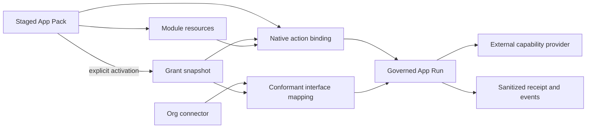

# Deft App Protocol v2 — Certified Implementation Contract

**Status:** Superseded as the implementation sequence on 2026-08-29; preserved as connected-App design input

**Date:** 2026-08-22  
**Code baseline:** `master` at `16bec544` (PRs #228–#231 merged)  
**Source proposal:** `Deft App Protocol v2 Implementation Plan.md`, reviewed as design input rather than executable instructions

The canonical implementation plan is now `../plans/2026-08-29-full-surface-app-platform.md`, with its opening sequence in `../plans/2026-08-29-app-platform-first-loops.md`. This specification's Module/Capability/App Run safety decisions remain useful input, but its provisional baseline, phase numbering, Pack-v0 scope, release gate, and claim to be the canonical implementation contract are superseded where they conflict with those plans and the current code.

## Decision

The proposal's central split is correct:

- Modules define durable resources and generic views.
- Capabilities define verbs implemented by external providers.
- App Packs compose modules, capability requirements, grants, and native action bindings.
- Governed App Runs provide one actor-neutral execution envelope.
- Connectors own credentials and provider connections.
- Skills remain optional reasoning material and are not part of the protocol's trusted execution path.

Modules must not gain author-defined tools, network access, SQL, secrets, workers,
approval tiers, token scopes, or trust changes. The broader application model is
built beside the closed module contract, not by weakening it.

This document is historical design input for the connected-App planes. The
current full-surface plan and accepted architecture decisions are authoritative
for implementation.

## Certified starting point

The branch may start only after a signed `v0.3.0-preview.3` release is published
from a green `master` commit and the live demo passes. The release commit will
replace the provisional baseline above without changing this architecture.

The starting point already includes:

- one shared actor/trust boundary for module reads and writes;
- eight frozen public module operations across Defty, employee MCP, and human MCP;
- structured, message-bound, org-authorized text attachments;
- deterministic CSV-to-module import with strict manifest validation;
- one full-review bulk-import approval, per-row idempotency, receipts, and
  PII-free terminal history;
- truthful proposal language that never claims a mutation completed before
  approval/execution;
- zero open CodeQL, Dependabot, or secret-scanning alerts at the preflight audit;
- checksummed release upgrades proven twice against representative chat, task,
  wiki, team, and agent-action data; and
- keyless release-image signing plus GitHub build-provenance verification gates.

`module_record_bulk_create` is an internal governed action used by deterministic
imports. It does not expand the frozen eight-operation inbound module catalog.

## Scope and native-equivalence claim

Phases 0–7 must reach native equivalence for four interactive actor surfaces:

| Surface | Identity and policy path | Required proof |
|---|---|---|
| Human UI | session user | Native binding button creates the same governed run |
| Defty | requesting human plus Defty runtime context | Same binding/capability, policy, receipt, and idempotency |
| Agent employee MCP | employee token and shadow user | Same grant checks plus employee health/budget checks |
| Human MCP | personal token owner | Same grant checks; external writes never bypass approval |

Automation is deliberately not claimed in Phases 0–7. Phase 8 must add a real
automation actor, trigger grants, scheduling, budgets, and the same App Run
envelope before the five-surface Native Equivalence claim is made. A test-only
`system` actor is not automation.

The first protocol proof is Contacts + Campaigns + a sandbox email provider.
It is not Gmail, Excel, Drive, Slack, GitHub, or a hosted marketplace.



## Artifact boundaries

### Module (`deft.module.json`)

Modules remain JSON-only resource definitions. Schema version `"1"` is frozen
as shipped, including `member`, `tags`, intra-installation `relation`, table,
board, timeline, form/detail configuration, and navigation.

Cross-installation references require schema version `"1.1"` and a new
`resource_ref` field. Existing `relation` semantics and database constraints
must not be widened.

Forbidden keys include executable or self-granting concepts such as `tools`,
`mcp_servers`, `capabilities`, `connectors`, `secrets`, `network`, `webhooks`,
`triggers`, `jobs`, `workers`, `cron`, `sql`, `runtime`, `skills`, `workflows`,
`trust_level`, `approval_tier`, `scopes`, `permissions`, `grants`, and `pack`.
Closed Zod objects are the primary enforcement; a deny-list is defense in depth.

### Capability

A capability is a Deft-owned verb interface such as `deft.email.send.v1`.
An outbound MCP tool is a provider implementation. Provider descriptions and
schemas are untrusted discovery data; they do not define Deft policy.

Defty may retain legacy visible names (`mcp__<slug>__<tool>`) during extraction.
Human and employee inbound MCP see only Deft interface IDs, never raw provider
keys.

### App Pack (`deft.app.json` v0)

An App Pack requests a composition of modules, cross-resource access,
capability interfaces, connector kinds, and native bindings. It cannot create
connectors, carry secrets, lower approval floors, expand existing MCP tokens,
raise trust, or activate background triggers.

Pack v0 intentionally omits Skills and triggers. Both are additive future wire
versions. This keeps optional prompt material and autonomous scheduling out of
the critical path for the first governed-verb proof.

### Connector

A connector is an org-owned credentialed provider connection. Pack staging may
request a connector kind/interface, but connector creation remains a separate
owner/admin operation. Pack activation can bind only an existing compatible
connector explicitly selected on the grant screen.

### Skill

Skills are reasoning instructions, not capabilities. A future public Skill
artifact must be strict, quote instructions as untrusted data, and forbid trust,
approval, secrets, network, tools, MCP servers, environment requirements, and
system-prompt injection. That work is useful but does not block App Protocol v2
Phases 0–7 and must not be smuggled into Pack v0.

## Capability identity, providers, and conformance

### Identities

The shared capability key is a closed union:

- internal provider key: `mcp:<connection-slug>:<original-tool-name>`;
- public interface ID: a registered value such as `deft.email.send.v1`.

`capability_invoke` accepts an interface ID. `connector_id` may be omitted only
when the current grant resolves to exactly one active, compatible provider.
Zero providers fails `CAPABILITY_PROVIDER_REQUIRED`; more than one fails
`CAPABILITY_CONNECTOR_REQUIRED` and returns safe choices.

### Provider snapshots

Snapshots are per provider tool, not per interface. Multiple connectors may
implement the same interface. The database identity is:

```text
(org_id, provider_kind, provider_id, provider_tool_name)
```

The unique constraint must use that tuple. It must not use
`(org_id, capability_key)` in a way that prevents multiple provider
implementations.

Each immutable snapshot contains the normalized provider input schema,
description digest, discovery timestamp, provider identity, and schema digest.
Snapshot writes are best-effort during list/discovery, but invocation always
does a live connector/grant check. A stale snapshot is never authorization.

### Interface mapping

`connector_interfaces` maps this tuple:

```text
(org_id, connector_id, provider_tool_name) -> interface_id
```

Within one connector, a provider tool maps to at most one interface and an
interface maps to at most one provider tool. Different connectors may map the
same interface.

For v1, mapping is accepted only when the normalized provider input schema is
structurally identical to the registered Deft interface input schema and its
declared result passes the interface result schema. Mismatch fails
`CAPABILITY_INTERFACE_SCHEMA_MISMATCH`. Arbitrary argument adapters are a later
protocol version and must not be hidden in admin JSON.

The invocation pins both `capability_snapshot_id` and
`connector_interface_id`. A schema digest change before execution fails closed
for external writes with `CAPABILITY_SCHEMA_DRIFT`.

### Policy floor

The interface registry is code-owned and includes its approval floor. Effective
tier is the maximum of the Deft interface floor and any stricter live actor,
connection, or org policy. Provider text and connection overrides may never
lower the floor. `deft.email.send.v1` is `full` review in Phases 0–7, including
Autonomous employees and personal MCP tokens.

## Governed App Runs

`CapabilityService.invoke` is the sole production provider-call seam and the
sole place that creates or attaches an App Run. Wrapping only
`agent-actions.ts` is insufficient because auto-tier Defty tools use a separate
execution path.

### Durable encrypted input snapshot

Every run stores:

- `input_digest`: SHA-256 of canonical plaintext input;
- `input_snapshot_encrypted`: authenticated encryption of the canonical input;
- `input_key_version`: the encryption-key version;
- the pinned provider snapshot and interface mapping IDs; and
- a sanitized preview containing only labels/resource IDs safe for approval UI.

Canonical input includes interface ID, validated arguments, resource context,
binding key, resolved resource/version digests, and selected connector mapping.
It excludes connector credentials and provider secrets, which are loaded live
at execution.

The encrypted snapshot is required because a queued approval must survive a
restart without placing email addresses, subject/body text, or other sensitive
arguments in `agent_actions`, events, receipts, logs, or browser responses.
Execution decrypts, validates, canonicalizes, and compares the digest before
calling the provider. Failure to decrypt or a digest mismatch fails closed.

Database triggers make the ciphertext, digest, key version, actor, capability,
idempotency digest, and pinned mapping immutable after insert. Only the internal
App Run service may select the ciphertext column. App Run HTTP/MCP serializers
must use explicit projections that omit it. Tests must prove it does not appear
in logs, errors, approval params, events, receipts, trace export, or API JSON.

### State and idempotency

Allowed states are:

```text
pending -> pending_approval -> running -> succeeded|failed|unknown_outcome
pending -> running
running -> waiting_external -> succeeded|failed|unknown_outcome|running
pending_approval -> cancelled
```

Illegal transitions fail `APP_RUN_ILLEGAL_TRANSITION`.

The replay key is unique on org, initiating actor, interface/provider identity,
and the digest of the caller-supplied idempotency key. Same key plus same input
digest returns the original run without a second approval, provider call, event,
or receipt. Different input fails `APP_RUN_IDEMPOTENCY_CONFLICT`.

Provider acceptance followed by a local log-write failure is `succeeded` with a
sanitized `log_write: failed` result and operator attention. It is not
`unknown_outcome`, and the provider must not be called again. A timeout or crash
after a non-idempotent call begins is `unknown_outcome` and requires inspection.

### Approval integration

There is one `agent_actions` row of kind `app_run_invoke` for a reviewed run.
Its params contain only `app_run_id`, capability/interface ID, binding key,
resource ID, and a sanitized preview. Raw input exists only in the encrypted run
snapshot.

Approval resolution reloads the run and rechecks actor membership, employee
health and daily budget, connector activity/assignment, current Pack grants,
interface floor, mapping, and schema digest. Approval is permission to attempt;
it is not permission to bypass current security state.

## Cross-app resource references

`module_resource_refs` stores `resource_ref` edges with separate source and
target installation identities plus `org_id`. Cross-org targets return
not-found. The target module/collection declared by the manifest is enforced at
write and resolution time.

Deleting or uninstalling a referenced target is blocked while live edges exist.
Disabling a target makes resolution return `available: false` without deleting
the edge. Campaigns references Contacts by canonical `module_record:<id>`;
contact values are not copied into Campaign records.

## Pack staging, provenance, ownership, and activation

Pack installation is a two-stage process.

### 1. Stage

Sideload validates every supplied artifact and writes immutable Pack-version
metadata, but grants nothing and enables nothing. Status is `staged` (or
`degraded` only after activation if an optional dependency is unavailable).

The staged version and its immutable `app_pack_artifacts` children record:

- canonical Pack manifest and digest;
- every resolved module artifact ID, version, manifest digest, license,
  source kind, and provenance available for that source;
- every capability interface version/digest from the Deft registry;
- every native binding digest; and
- one aggregate resolution digest over the ordered artifact set.

Each child retains the canonical artifact payload needed for later activation.
This is required because current `module_versions` rows belong to a concrete
`module_installation`; a missing module cannot be staged there without already
changing active workspace state. Activation installs from the pinned staged
payload through `ModuleService`, never from a newly uploaded or re-resolved
manifest.

Bundled artifacts require repository/commit provenance consistent with the
existing module provenance lock. Local sideloads always require exact canonical
digests and record their source as `sideloaded`; they must not claim Git
provenance that cannot be proven.

Staging is transactional. Any missing artifact, digest mismatch, incompatible
module version, invalid binding, or unknown interface leaves no staged
installation/version/artifact rows. Provider schema conformance is revalidated
when activation binds the admin-selected connector.

### 2. Activate

The grant screen shows requested versus granted rights and exact dependency
digests. Required checkboxes default unchecked. Activation atomically:

- installs/enables only approved missing module dependencies;
- records cross-resource access;
- binds explicitly selected compatible connectors;
- writes an append-only grant snapshot;
- records dependency ownership; and
- advances the installation's active version/grant pointers.

No action binding is callable while status is `staged`, `degraded` for a
required dependency, or `disabled`.

### Dependency ownership

`app_installation_artifacts` records whether each exact dependency was
`preexisting`, `installed_by_pack`, or shared with another Pack. Disabling a
Pack drops its grants and bindings but never disables a preexisting dependency.
A dependency installed by a Pack may be offered for separate confirmed disable
only when no other enabled Pack or direct installation owns/uses it and live
resource references allow it. There is no implicit cascade.

### Upgrade

An upgrade stages a new immutable resolved artifact set first. It then computes
a grant/dependency diff against the active version. New capabilities,
connectors, resource targets, bindings, module writes, or broader access require
fresh confirmation. Activation is an atomic pointer swap; failure leaves the
old version active.

Pack v0 is multipart JSON, not zip and not install-by-URL.

## Public inbound catalog and scopes

The capability/App Run inbound catalog is frozen at five operations:

1. `capability_list`
2. `capability_get`
3. `capability_invoke`
4. `app_run_get`
5. `app_binding_invoke`

Packs, modules, and providers cannot add inbound tool names.

New read/invoke scopes are advertised but are never added silently to existing
personal tokens, write presets, or OAuth defaults. Module write permission does
not imply external invoke permission. Inbound invocation requires an explicit
current App grant (or the same grant table with an admin source), a known
interface, and a compatible selected connector.

## Native action bindings

Bindings are Pack-owned, Deft-rendered declarations. They identify a resource
collection, interface ID, and a closed argument map. Initial expressions are:

- `field:<field_key>`
- `ref:<resource_ref_field>.<target_field>`

No literals, scripts, templates, arbitrary JSONPath, or skill-supplied values
are allowed in v0. Binding resolution uses the exact record and dependency
versions pinned into the encrypted App Run input snapshot. Missing/disabled
references fail before provider invocation.

The same binding key must produce the same governed run path from Human UI,
Defty, employee MCP, and human MCP.

## Phases and merge gates

### Phase 0 — Freeze and reconcile

- Amend module v1 docs to match shipped fields and the eight public operations.
- Add closed-schema/forbidden-key tests.
- Land this Native Equivalence matrix and protocol terminology.
- Add flags for App Runs, refs, Packs, and bindings; defaults off.

### Phase 1 — Capability Service extraction

- Add shared capability/interface schemas.
- Add per-provider snapshots with tuple uniqueness.
- Route every production `mcpClientManager.executeTool` call through one provider
  adapter while preserving current Defty names, payloads, and approval behavior.
- Grep/test the single execute seam.

### Phase 2 — Governed App Runs

- Add state machine, immutable encrypted inputs, events, idempotency, sanitized
  approvals, receipts, and live execution rechecks.
- Prove auto-tier and reviewed legacy provider calls both create one run and at
  most one provider call when the flag is on.

### Phase 3 — Cross-app references

- Add module schema `1.1`, `resource_ref`, database edges, resolver, generic UI
  picker, disable behavior, and uninstall protection.
- Prove Campaign fixture references Contact without copying it.

### Phase 4 — Pack staging and grants

- Add strict Pack v0 parser, immutable multi-artifact snapshots, ownership rows,
  staged install, explicit activation, grant UI, and permission-diff upgrades.
- Add connector-interface mapping with exact schema conformance and interface
  approval floors.

### Phase 5 — Inbound capability catalog

- Add opt-in scopes and the frozen five operations.
- Return only granted interface IDs.
- Prove old tokens remain blind and external writes always use App Runs.

### Phase 6 — Native action bindings

- Add closed binding resolver and generic module detail action bar.
- Expose the same binding through all four interactive surfaces.

### Phase 7 — Marketing proof and hardening

- Use independent Contacts, Campaigns, and sandbox-email artifacts.
- Stage, review, activate, send, approve, write a sanitized send-log record,
  verify receipt, replay without duplicate send, and exercise log-write failure.
- Core must contain no Campaign/CRM-specific service, branch, tool, or renderer.

### Phase 8 — Automation and optional artifact extensions

- Define real trigger grants, automation actor identity, schedules, cost/action
  budgets, circuit breakers, and App Run ancestry.
- Only then claim five-surface Native Equivalence.
- Strict public Skills and Pack skill composition may proceed independently here
  or in a separately reviewed minor wire version; neither blocks Phase 7.

Each phase merges only with typecheck/lint, unit/integration tests, disposable
Postgres tests for new persistence, security workflows, production image/browser
smoke, and versioned-upgrade preservation green on the final commit.

## Data-model summary

| Phase | Tables/change | Critical constraints |
|---|---|---|
| 1 | `capability_snapshots` | Unique provider tuple; immutable schema snapshot; no authorization from cache |
| 2 | `app_runs`, `app_run_events` | Org scoped; immutable encrypted input; idempotency unique; explicit serializers |
| 3 | `module_resource_refs` | Separate source/target installation FKs; same org; no widening of `relation` |
| 4 | `app_pack_versions`, `app_pack_artifacts`, `app_installations`, `app_grants`, `app_installation_artifacts`, `connector_interfaces` | Immutable staged payloads/resolution set; explicit activation; append-only grants; ownership; multi-provider mappings |

Every table has `org_id`, timestamps appropriate to its role, and cuid2/text IDs.
Immutable version/event ledgers do not use soft delete. Upgrade SQL is ordered and
checksummed through `pnpm db:upgrade`; raw `drizzle-kit push` is not an upgrade
path. The first new migration slot is determined from the certified preview.3
release manifest immediately before branching; it must not be copied from an
older draft.

## Security and privacy gates

- All org/actor identity comes from authenticated context, never arguments.
- Provider descriptions, Pack copy, module data, CSVs, and future skill text are
  untrusted data, never policy/system instructions.
- Approval previews, events, receipts, traces, and logs contain identifiers and
  safe labels only; no provider secrets or raw external-write arguments.
- App Run input ciphertext never appears in generic ORM selections or response
  spreads; explicit projections are mandatory.
- Interface floors are code-owned and can only be raised.
- Pack staging grants nothing; requested rights are not effective rights.
- Connector deletion/disable and grant revocation are rechecked at execution.
- Non-idempotent unknown outcomes are never automatically retried.
- New token scopes are opt-in and existing tokens remain unchanged.
- No Pack may install code, create a connector, or activate automation.

## Release-to-branch gate

Before the implementation branch is created:

1. This spec is merged with all default-branch checks green.
2. `v0.3.0-preview.3` is tagged from that exact green commit.
3. The release job publishes and verifies the GHCR signature and provenance.
4. The immutable image digest is recorded and deployed to `demo.deft.ing`.
5. Diego uploads a realistic contact CSV and asks Defty to import it.
6. Defty resolves Contacts deterministically, prepares exactly one truthful
   full-review proposal, and performs no write before approval.
7. Approval creates the expected records; the Contacts UI displays them.
8. Replay with the same idempotency input creates no duplicate records.
9. Live receipts/history contain no CSV row values or raw retry keys.
10. Health, browser smoke, security alerts, and release verification remain green.

Only after all ten pass is `codex/app-protocol-v2` created from the certified
release commit. No App Protocol implementation commit may precede that branch.

## Explicit non-goals for Phases 0–7

- Gmail, Slack, GitHub, Drive, Excel, or other first-party SaaS integrations
- author-defined MCP tools or per-collection generated tools
- module network, SQL, secrets, workers, or triggers
- arbitrary binding code/templates
- automatic connector creation
- silent token/scope/trust expansion
- Pack skills or Pack triggers in wire v0
- hosted marketplace, install-by-URL, zip bundles, or payments
- Campaign/Contacts domain logic in Deft core
- claiming automation equivalence before Phase 8

## Resolved implementation questions

- App Runs must persist encrypted executable input, not only a digest.
- Multiple connectors can implement one interface; snapshots are provider-tuple
  unique and mappings must pass interface-schema conformance.
- Phase 7 proves four interactive surfaces; automation is Phase 8.
- Pack install is staged then explicitly activated, with multi-artifact digests,
  provenance, permission diffs, and dependency ownership.
- Strict public Skills are removed from the critical path and Pack v0.
- The implementation baseline and next migration slot come from the signed
  preview.3 commit, not the stale commit/version numbers in the source proposal.
